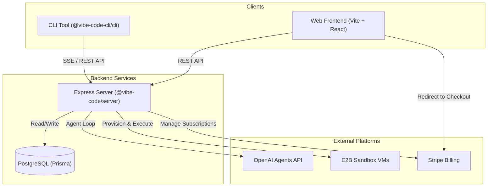
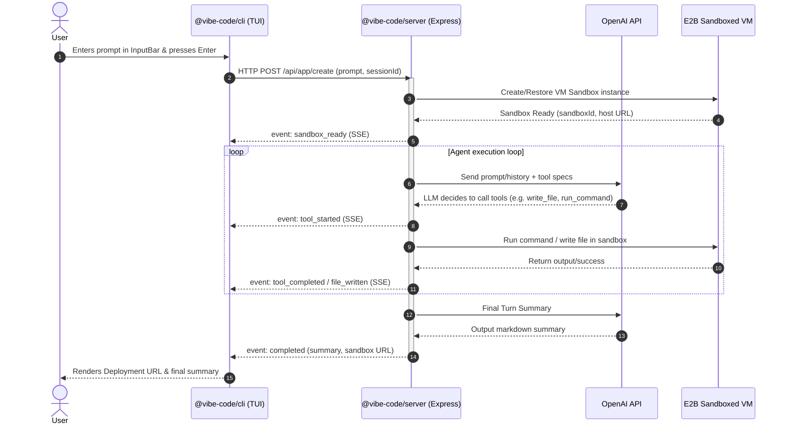
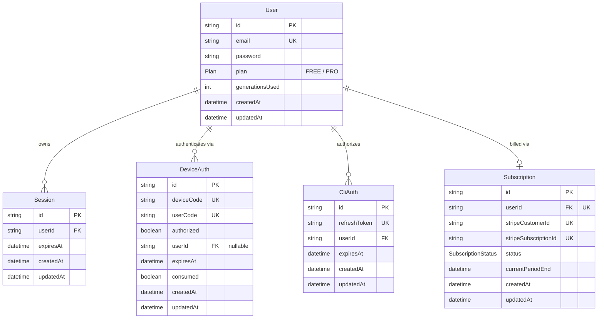

# 🚀 Vibe Code

Vibe Code is a state-of-the-art terminal-based AI website builder. Using a modern Terminal User Interface (TUI) built on React and OpenTUI, it allows developers to build, test, and deploy web applications using a real-time multi-turn agent streaming conversation. Secure execution environments are provided dynamically via E2B Sandboxes.

---

## ⚡ Features

- **Rich Terminal User Interface (TUI)**: Fully dynamic, responsive dashboard designed with React and OpenTUI (`@opentui/react`, `@opentui/core`).
- **OAuth2 Device Login Flow**: Easy CLI authentication via standard browser-device verification flow.
- **Sandboxed Agent Actions**: Secure, stateful code execution inside Docker-based VMs handled via the E2B Code Interpreter SDK.
- **Server-Sent Events (SSE)**: Streams real-time agent status, file updates, and terminal operations dynamically from server to CLI client.
- **Multi-turn Chat Support**: Retains sandbox contexts and conversation history (`sessionId`) across follow-up requests.
- **Stripe Subscription Billing**: Tiered credit system (Free vs. Pro plans) with automated checkout and management portal flows.
- **Interactive Swagger Documentation**: Built-in Swagger API docs available locally at `/api-docs`.

---

## 🛠️ Tech Stack

### CLI & TUI

- **React 19** - UI rendering framework
- **OpenTUI** - Node terminal rendering library (`@opentui/core` & `@opentui/react`)
- **tsup** - TypeScript package bundler

### Web Frontend

- **React 19 & Vite** - Client application bundle
- **TailwindCSS v4** - High performance utility-first styling
- **TanStack React Query** - Server state management & caching
- **Zustand** - Global state management
- **React Router DOM** - Frontend routing

### Backend Server

- **Express.js (v5)** - REST API & Server-Sent Events controller
- **OpenAI Agents Framework** - LLM orchestrator & runtime (`@openai/agents`)
- **E2B Code Interpreter SDK** - Provisioning & controlling sandbox VMs
- **Prisma ORM** - Database client schema generation
- **Stripe SDK** - Handling customer checkouts and portal redirection
- **winston** - Structured server logging

### Database

- **PostgreSQL** - Relational database for accounts, sessions, and billing history

### Deployment & Infrastructure

- **Docker & Docker Compose** - Container orchestrator
- **Turborepo** - Monorepo build pipeline management

---

## 📂 Project Structure

```text
├── apps/
│   ├── cli/           # CLI TUI tool (bin: vibecode)
│   ├── server/        # Express API & Agent orchestrator
│   └── web/           # React SPA web app (dashboard, billing, device flow)
├── packages/
│   ├── eslint-config/ # Shared linting rules
│   ├── sandbox/       # Custom E2B Dockerfile templates & build check scripts
│   ├── tsconfig/      # Shared TypeScript compiler options
│   └── ui/            # Shared React UI components
├── docker-compose.yml # Dev environment docker compose
├── package.json       # Monorepo configuration (Bun workspaces)
└── turbo.json         # Turborepo task runner configuration
```

---

## 🏁 Getting Started

### Prerequisites

- **Bun** (>= 1.2.23) installed globally.
- **PostgreSQL** database (optional if running via Docker).
- **OpenAI API Key** (for GPT-5-mini model execution).
- **E2B API Key** (for provisioning VMs at [e2b.dev](https://e2b.dev)).

### Installation

1. **Clone the repository:**

   ```bash
   git clone https://github.com/nilavtalukdar06/cli-website-builder.git
   cd cli-website-builder
   ```

2. **Install dependencies:**
   ```bash
   bun install
   ```

### Environment Variables

Create a `.env` file in `apps/server/` to configure the backend API:

| Variable                | Description                               | Default / Example              |
| :---------------------- | :---------------------------------------- | :----------------------------- |
| `PORT`                  | The port on which the Express server runs | `5500`                         |
| `OPENAI_API_KEY`        | OpenAI API key for agent model execution  | `sk-proj-...`                  |
| `E2B_API_KEY`           | E2B API Key for sandboxing                | `e2b_...`                      |
| `E2B_TEMPLATE_ID`       | Custom E2B Sandbox template ID            | `qbfuql3...`                   |
| `DATABASE_URL`          | PostgreSQL connection string              | `postgresql://...`             |
| `JWT_SECRET`            | Signing secret key for CLI JWT auth       | `PP61YNZ...`                   |
| `CORS_ORIGIN`           | Commas-separated allowed origins          | `http://localhost:3000`        |
| `VERIFICATION_URL`      | Device flow browser entry point           | `http://localhost:3000/device` |
| `STRIPE_SECRET_KEY`     | Stripe secret key for subscriptions       | `sk_test_...`                  |
| `STRIPE_PRICE_ID`       | Price ID for the Stripe Pro plan          | `price_...`                    |
| `STRIPE_WEBHOOK_SECRET` | Stripe webhook validation key             | `whsec_...`                    |
| `CLIENT_URL`            | URL of the frontend client website        | `http://localhost:3000`        |
| `NODE_ENV`              | Mode of runtime execution                 | `development`                  |

---

## 🏃 Running Locally

Run the development servers for all workspaces in parallel:

```bash
bun run dev
```

This starts:

- **Server**: `http://localhost:5500` (API & Swagger docs)
- **Web App**: `http://localhost:3000` (Frontend)
- **CLI**: Available for execution in the terminal

### Development Tasks

- **Format files**:
  ```bash
  bun run format
  ```
- **Lint workspaces**:
  ```bash
  bun run lint
  ```
- **Type Checking**:
  ```bash
  bun run check-types
  ```
- **Build assets**:
  ```bash
  bun run build
  ```

---

## 🐳 Docker

You can spin up the Postgres database and backend server inside containerized environments.

### 1. Build and Run via Docker Compose

Configure your environment variables in `.env` or pass them through, then run:

```bash
docker-compose up --build
```

This starts:

- A PostgreSQL database on port `5432` with automated health checks.
- The Express server on port `5500`.

### 2. Standalone Docker Image Build

If you want to build the server image individually:

```bash
docker build -t vibe-code-server -f apps/server/Dockerfile .
```

---

## 🕹️ Usage

### CLI Commands

The CLI package builds to a binary named `vibecode`.

#### Login (OAuth2 Device Flow)

```bash
vibecode login
```

This prints a unique code and opens your default browser at the verification URL. Confirm the code to authenticate the CLI.

#### Launch Interactive Builder (TUI)

```bash
vibecode
```

Starts the full-screen terminal TUI where you can enter prompts to design, generate, and iterate on Next.js/React websites.

#### Logout

```bash
vibecode logout
```

Clears local refresh tokens from your machine (`~/.vibecode/auth.json`).

---

## 📐 System Architecture

Vibe Code connects terminal interfaces, standard web browsers, and isolated sandboxes into a cohesive system.

### Component Relationship



### Execution & Messaging Loop



### Database Schema (ER Diagram)

The PostgreSQL database structure and relationships, defined via Prisma, are structured as follows:



---

## 📡 API Documentation

Interactive Swagger documentation is available at `http://localhost:5500/api-docs` when running the server.

### Endpoints Summary

#### Authentication (`/api/auth`)

- `POST /api/auth/sign-up`: Register a user.
- `POST /api/auth/login`: Login user and receive session cookie.
- `GET /api/auth/me`: Get profile session of logged-in user.
- `POST /api/auth/cli/refresh`: Refreshes CLI access token.
- `POST /api/auth/logout`: Clears session and logs out.

#### Device Authorization (`/api/device`)

- `POST /api/device/create`: Creates a new device flow user code.
- `POST /api/device/authorize`: User authorizes user code via browser.
- `POST /api/device/poll`: CLI polls status to fetch refresh tokens.

#### App Generation (`/api/app`)

- `POST /api/app/create`: Triggers agent loop (SSE stream) to build websites.

#### Billing & Subscriptions (`/api/billing`)

- `POST /api/billing/checkout`: Retrieves Stripe Checkout session URL.
- `POST /api/billing/portal`: Generates Stripe Billing Customer portal link.

---

## ⚙️ Configuration

### Subscription Tiers

Vibe Code implements generation limits based on database plans:

- **FREE**: 2 generations maximum. Attempts beyond this block the request and output a Stripe checkout link.
- **PRO**: Unlimited generation turns.

### Sandboxed Templates

The agent executes operations inside E2B container instances defined in `packages/sandbox/`:

- **Base image**: `node:21-slim`
- **Preinstalled items**: Next.js 15.3.3 app, TailwindCSS, shadcn@2.6.3 components.
- **Startup script**: Runs `compile_page.sh` which executes `next dev --turbopack` and verifies readiness via polling.

---

## 🗺️ Roadmap

- [x] Full terminal-based interactive TUI dashboard.
- [x] Isolated E2B sandboxes integrations.
- [x] Device authentication flow for terminal clients.
- [x] Stripe subscription limits (Free/Pro tiers).
- [x] Docker & Docker Compose setup.
- [ ] Direct Vercel / Netlify static deployment from sandbox.
- [ ] Shared workspace templates (Vite, Astro, etc.).
- [ ] Collaborative multiplayer building.

---

## 🤝 Contributing

We welcome contributions! To suggest changes:

1. **Fork** the repository.
2. Create a new feature branch:
   ```bash
   git checkout -b feature/your-awesome-feature
   ```
3. **Commit** your modifications with clear messages:
   ```bash
   git commit -m "feat: add support for vite template"
   ```
4. **Push** your branch:
   ```bash
   git push origin feature/your-awesome-feature
   ```
5. Open a **Pull Request** explaining your implementation details.

---

## 📄 License

This project is licensed under the MIT License.
