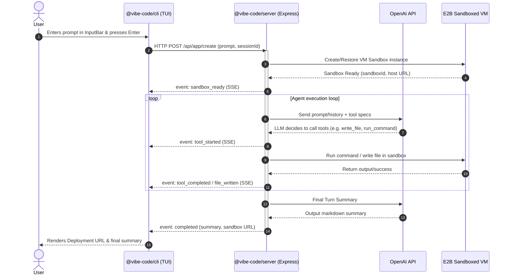

# 🚀 Vibe Code

Vibe Code is a state-of-the-art terminal-based AI website builder. Using a modern Terminal User Interface (TUI) built on React and OpenTUI, it allows developers to build, test, and deploy applications using a real-time multi-turn agent streaming conversation. Secure execution environments are provided dynamically via E2B Sandboxes.

---

## 🗺️ System Architecture

The following diagram illustrates the data flow and communication protocol between the CLI client, Express backend, OpenAI agents, and E2B Sandboxes:



---

## ✨ Features

- **Rich Terminal User Interface (TUI)**: Fully dynamic, responsive dashboard designed with React and OpenTUI (`@opentui/react`, `@opentui/core`).
- **Dynamic Terminal Sizing**: Adapts container dimensions to the terminal window in real-time.
- **Server-Sent Events (SSE)**: Streams agent status, file updates, and terminal operations dynamically from server to TUI.
- **Real-Time Visual Loader**: White rotating loading indicator (`/`, `-`, `\`, `|`) showing active compilation turns.
- **Sandboxed Agent Actions**: Secure, stateful code execution in Docker-based VMs handled via the E2B Code Interpreter SDK.
- **Multi-turn Chat Route**: Retains sandbox contexts and previous conversation history (`sessionId`) to support follow-up requests.
- **Clean Message-Style Input**: Hides input bars while building is in progress, showing a dedicated left-aligned chat prompt when waiting for user follow-up.

---

## 📂 Project Structure

This monorepo is managed using Turborepo and Bun:

```text
├── apps/
│   ├── cli/           # @vibe-code/cli - React TUI client
│   └── server/        # @vibe-code/server - Express agent controller API
├── packages/
│   ├── eslint-config/ # Shared eslint config
│   ├── sandbox/       # E2B Sandbox configuration & Docker templates
│   ├── typescript-config/ # Shared tsconfig bases
│   └── ui/            # UI components (if any shared)
├── package.json       # Monorepo packages and workspaces layout
└── turbo.json         # Turborepo task runner configuration
```

---

## 🛠️ Installation & Setup

### Prerequisites
- **Bun** (>= 1.2.23) installed globally.
- **E2B API Key** (Get one at [e2b.dev](https://e2b.dev)).
- **OpenAI API Key** (API access for GPT models).

### 1. Clone the repository and install dependencies
```bash
bun install
```

### 2. Configure Environment Variables
Create a `.env` file in `apps/server/`:
```env
PORT=5500
OPENAI_API_KEY=your-openai-api-key
E2B_API_KEY=your-e2b-api-key
E2B_TEMPLATE_ID=your-custom-sandbox-template-id-if-any
```

---

## 🚀 Running the Project

To start the server and the CLI TUI simultaneously, run the dev task from the **workspace root**:

```bash
bun run dev
```

This commands executes `turbo run dev`, starting:
- **Server** at `http://127.0.0.1:5500`
- **CLI** directly in your terminal window

---

## 📦 Packages Breakdown

### CLI Client (`@vibe-code/cli`)
Built using OpenTUI for node terminal rendering. Key files:
- `src/index.tsx`: Main routing and SSE streaming handler. Monitors key bindings, reads stream chunks, and manages full-height viewport components.
- `src/components/input-bar.tsx`: Sleek search bar styled text input containing context status indicators.
- `src/components/header.tsx`: Ascii Art logo.

### Backend Server (`@vibe-code/server`)
Express server wrapped around the OpenAI agents framework. Key files:
- `src/controllers/create-app.ts`: SSE router handler. Streams JSON packets and final completions.
- `src/services/agents.ts`: Manages session pools and sandboxes, matching `sessionId` to execute LLM tool calls.
- `src/sandbox/sandbox.ts`: Orchestrates container templates via the `@e2b/code-interpreter` SDK.
